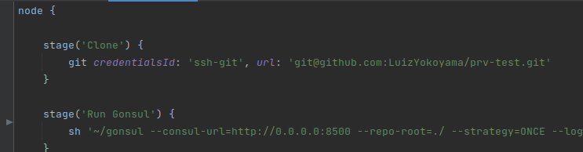

# Jenkins pipeline with Gonsul updating key/values to Consul

Esta é uma demonstração de uma pipeline do Jenkins que baixa o código de um repositório privado git com ***ssh*** e ativa o ***Gonsul*** para 
enviar as configurações ***key/values*** para o *Consul*.

## Passos para execução:

### Consul

Ative o ***Consul*** no docker, executando o comando:

* ***docker-compose up***

O Consul estará disponível no endereço:

* http://0.0.0.0:8500

### Instalar e inicializar o Jenkins:

O Jenkins pode ser instalado em um Docker, Kubernetes, Linux e vários outros sistemas.

Nesta demonstração será usado o Jenkins instalado no ***Linux***.

Mais informações sobre a instalação do Jenkins estão disponíveis na sua documentação oficial:

* https://www.jenkins.io/doc/book/installing/

Para instalar o ***Jenkins*** no Linux ***Debian/Ubuntu***:

#### Executar:

***sudo apt-get update***

***sudo apt-get install jenkins***

#### Iniciar Jenkins:

Você pode ativar o serviço Jenkins para iniciar na inicialização do sistema Linux com o comando:

***sudo systemctl enable jenkins***

Ou você pode iniciar o serviço Jenkins com o comando:

***sudo systemctl start jenkins***

Você pode verificar o status do serviço Jenkins usando o comando:

***sudo systemctl status jenkins***

Se tudo foi configurado corretamente, você deve ver uma saída como esta:

# Adicionar o Gonsul no Jenkins

Copie o arquivo executável do ***Gonsul*** para o ***diretório de instalação*** do ***Jenkins***: ***var/lib/jenkins***

O arquivo executável do Gonsul está disponível neste reposítório.

### Acessar a pagina do Jenkins:
***http://localhost:8080/***

#### Adicionar credenciais no Jenkins:

http://localhost:8080/manage/credentials/

Clicar em:

Na tela que abrir, no seu canto superior direito, clicar em "+ Add Credentials":

Crie uma credencial do tipo *SSH Username with private Key*, com o ***ID*** "*ssh-git*":

* O Username não será necessário preencher.

* Inserir a sua chave ***ssh privada***:

* Se ainda não tiver uma ***chave ssh***, é necessário criar uma ***chave ssh*** com o comando no *terminal linux*:

***ssh-keygen -t rsa***

* Use este comando para visualizar o conteúdo da ***chave ssh privada*** que acabou de gerar: 

***cat id_rsa***

* Copie todo o conteúdo, volte ao ***Jenkins*** e cole sua ***chave ssh privada***:

* Após criar a ***credencial*** no ***Jenkins***, use o seguinte comando para vizualizar o conteúdo de sua ***chave ssh pública***:

***cat id_rsa.pub***

* Vá ao seu repositório ***privado*** do ***github*** que será usado para guardar as ***key/values***, em ***Settings/Deploy Keys***, clique no botão ***add deploy Key*** e crie
uma ***deploy key*** colando todo o conteúdo desta ***chave ssh pública***.

#### Clonar este repositório

Clonar este repositório será preciso somente caso exista necessidade de alterar algum arquivo, como o ***Jenkinsfile***.

### Criar uma nova Pipeline no Jenkins

Na página inicial do Jenkins, click em "***+ Nova tarefa***":

Depois coloque um nome como ***Jenkins-Gonsul*** para a tarefa, escolha Pipeline e depois click no botão Tudo certo:

* Com a *pipeline* criada, entre nela e vá em ***Configurar***:

Em GitHub project, insira a url do repositório privado que contém as ***keys/values***, 
que neste cado é https://github.com/LuizYokoyama/prv-test/.

Em ***Pipeline > Definition*** escolha ***Pipelline script from SCM*** e preencha assim:

Agora é necessário usar a URL do repositório que contém o Jenkinsfile, que é a deste repositório.

Seguindo para ***Pipeline > Script Path*** preencha com ***Jenkinsfile***, para este arquivo do repositório ser usado na pipeline.

* Em ***Build Triggers***, marque ***consultar periodicamente o SCM*** e preencha com "H/2 * * * *" para o ***Jenkins*** consultar se 
houve alterações no ***repositório privado*** das ***keys/values*** a cada 2 minutos:

* Salve as alterações.

# Configurações do Gonsul

As configurações do ***Gonsul*** estão no ***Jenkinsfile***, na própria linha de comando que roda o ***Gonsul***:

### O ***Gonsul*** atualizará automaticamente as ***keys/values*** no ***Consul*** com os valores do ***repositório privado***:

